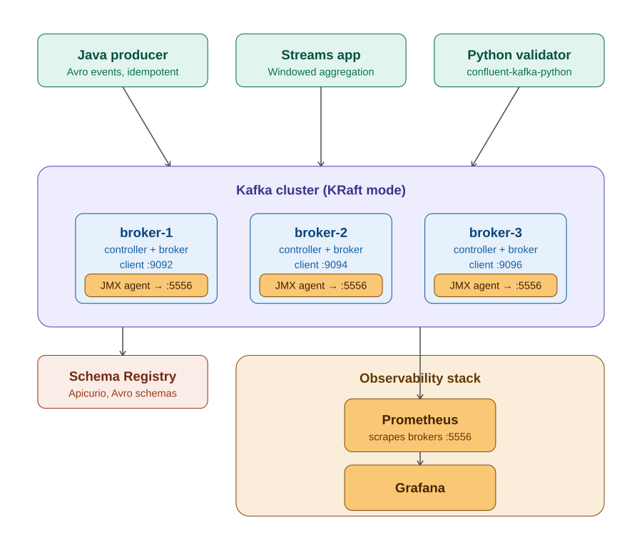

# Kafka Pet Project — Architecture & Reference

# 1. Project goal

Build a small but production-shaped Kafka pipeline that demonstrates broker-level understanding, not just client-API usage. The point is not the application
logic — it is the cluster, the schemas, the failure modes, and the observability.
By the end of the week the repo should let you say: "I ran a 3-broker KRaft cluster, registered Avro schemas, wrote a Streams app with exactly-once semantics,
broke the cluster 4 different ways, and have Grafana dashboards showing what happened." That sentence is the interview deliverable.

## Stack at a glance

* Kafka 3.7+ in KRaft mode, 3 brokers (each is both controller and broker for simplicity)
* Apicurio Schema Registry + Avro
* Java 21, Maven multi-module project
* Kafka Streams for the processing app, plain producer/consumer for the rest
* Python 3.11 with confluent-kafka-python for a validator/load generator
* Prometheus + Grafana + JMX exporter for observability
* Testcontainers for integration tests, GitHub Actions for CI

## Repo layout

```text
kafka-streams-playground/
├── README.md                    # The headline artifact. Keep it current.
├── compose/
│   ├── docker-compose.yml       # Brokers, registry, prom, grafana
│   ├── jmx-exporter-config.yml  # JMX -> Prometheus rules
│   ├── prometheus.yml
│   └── grafana/
│       └── dashboards/kafka.json
├── schemas/
│   ├── order-placed.avsc
│   └── customer-profile.avsc
├── app/
│   ├── pom.xml                  # Parent POM
│   ├── common/                  # Avro types, config
│   ├── producer/                # Order event producer
│   ├── streams/                 # Windowed aggregation app
│   └── consumer/                # Output topic consumer
├── python/
│   ├── requirements.txt
│   ├── load_generator.py
│   └── output_validator.py
├── docs/
│   ├── failure-scenarios.md     # Lab notebook — interview gold
│   └── design-notes.md          # Why you chose X over Y
└── .github/
    └── workflows/
        └── ci.yml
```

# 2. Architecture



The system has three logical layers: producers and clients on top, the Kafka cluster in the middle, and Schema Registry plus observability on the bottom.
Producers and the Streams app write to and read from the cluster over the standard 9092 protocol. The JMX exporter scrapes each broker's metrics on a sidecar
port; Prometheus pulls from the exporters; Grafana queries Prometheus.
Producers and consumers reach Schema Registry over HTTP to fetch and register Avro schemas. The Streams app caches schemas locally; this is why a registry
restart doesn't immediately break in-flight processing.

## Topics

```text
orders-placed        partitions=6  replication=3  retention=7d
customer-profiles    partitions=6  replication=3  cleanup.policy=compact
orders-per-window    partitions=6  replication=3  retention=24h
dead-letter          partitions=3  replication=3  retention=14d
```

orders-per-window is the output of the Streams aggregation. customer-profiles is compacted because it is a KTable source — only the latest value per key
matters.

# 3. Docker Compose — the cluster

This is the file you spend Day 3 on. Get this working end-to-end before writing any application code.

## Broker pattern (repeat 3 times)

Use the same image and KAFKA_PROCESS_ROLES on all three. Each gets a unique KAFKA_NODE_ID.
KAFKA_CONTROLLER_QUORUM_VOTERS is identical across all three — it lists all controllers.

```yaml
services:
  kafka-1:
    image: apache/kafka:3.7.0
    container_name: kafka-1
    ports:
      - "9092:9092"
      - "9101:9101"            # JMX
    environment:
      KAFKA_NODE_ID: 1
      KAFKA_PROCESS_ROLES: 'broker,controller'
      KAFKA_LISTENERS: 'PLAINTEXT://:9092,CONTROLLER://:9093'
      KAFKA_ADVERTISED_LISTENERS: 'PLAINTEXT://kafka-1:9092'
      KAFKA_LISTENER_SECURITY_PROTOCOL_MAP:
        'CONTROLLER:PLAINTEXT,PLAINTEXT:PLAINTEXT'
      KAFKA_CONTROLLER_QUORUM_VOTERS:
        '1@kafka-1:9093,2@kafka-2:9093,3@kafka-3:9093'
      KAFKA_CONTROLLER_LISTENER_NAMES: 'CONTROLLER'
      KAFKA_INTER_BROKER_LISTENER_NAME: 'PLAINTEXT'
      KAFKA_OFFSETS_TOPIC_REPLICATION_FACTOR: 3
      KAFKA_TRANSACTION_STATE_LOG_REPLICATION_FACTOR: 3
      KAFKA_TRANSACTION_STATE_LOG_MIN_ISR: 2
      KAFKA_AUTO_CREATE_TOPICS_ENABLE: 'false'
      KAFKA_JMX_PORT: 9101
      KAFKA_JMX_HOSTNAME: kafka-1
      KAFKA_CLUSTER_ID: 'MkU3OEVBNTcwNTJENDM2Qk'   # any base64-encoded UUID
    volumes:
      - kafka-1-data:/var/lib/kafka/data
```

## Schema Registry

```yaml
apicurio:
  image: apicurio/apicurio-registry-mem:2.5.10.Final
  container_name: apicurio
  ports:
    - "8080:8080"
  environment:
    QUARKUS_PROFILE: prod
```

## Observability

```yaml
jmx-exporter-1:
  image: bitnami/jmx-exporter:1.0.1
  command: [ "5556", "/config.yml" ]
  environment:
    JMX_EXPORTER_HOST: kafka-1
    JMX_EXPORTER_PORT: 9101
  volumes:
    - ./jmx-exporter-config.yml:/config.yml
  # (one per broker, ports 5556/5557/5558)

prometheus:
  image: prom/prometheus:v2.51.0
  ports: [ "9090:9090" ]
  volumes:
    - ./prometheus.yml:/etc/prometheus/prometheus.yml

grafana:
  image: grafana/grafana:10.4.2
  ports: [ "3000:3000" ]
  environment:
    GF_SECURITY_ADMIN_PASSWORD: admin
  volumes:
    - ./grafana/dashboards:/var/lib/grafana/dashboards
```

## Smoke test (do this before any app code)

```shell
docker compose up -d
docker exec -it kafka-1 /opt/kafka/bin/kafka-broker-api-versions.sh \
  --bootstrap-server kafka-1:9092
 
docker exec -it kafka-1 /opt/kafka/bin/kafka-topics.sh \
  --bootstrap-server kafka-1:9092 \
  --create --topic orders-placed --partitions 6 --replication-factor 3
 
docker exec -it kafka-1 /opt/kafka/bin/kafka-topics.sh \
  --bootstrap-server kafka-1:9092 --describe --topic orders-placed
```

If --describe shows Leader, Replicas, and Isr all populated across the three brokers, your cluster is healthy,
and you can start writing application code

# 4. Avro shcemas

Both schemas live in /schemas and are registered with Apicurio at app startup. Keep them small and obvious.

order-placed.avsc

```json
{
  "type": "record",
  "namespace": "com.zsolt.kafka.events",
  "name": "OrderPlaced",
  "fields": [
    {
      "name": "orderId",
      "type": "string"
    },
    {
      "name": "customerId",
      "type": "string"
    },
    {
      "name": "amountCents",
      "type": "long"
    },
    {
      "name": "currency",
      "type": "string",
      "default": "EUR"
    },
    {
      "name": "placedAt",
      "type": {
        "type": "long",
        "logicalType": "timestamp-millis"
      }
    }
  ]
}
```

customer-profile.avsc

```json
{
  "type": "record",
  "namespace": "com.zsolt.kafka.events",
  "name": "CustomerProfile",
  "fields": [
    {
      "name": "customerId",
      "type": "string"
    },
    {
      "name": "country",
      "type": "string"
    },
    {
      "name": "tier",
      "type": {
        "type": "enum",
        "name": "Tier",
        "symbols": [
          "FREE",
          "PRO",
          "ENTERPRISE"
        ]
      }
    }
  ]
}
```

Day 4 exercise: try an incompatible schema change (rename a required field). Watch the registry reject it.
This is a 30-second exercise that gives you a real story to tell.

# 5. Java Application

## Producer essentials

Two settings make this an interview-grade producer rather than a tutorial one.

```java
static { // (static block here just to make intellij happy)
    Properties props = new Properties();
    props.put(ProducerConfig.BOOTSTRAP_SERVERS_CONFIG,
            "localhost:9092,localhost:9094,localhost:9096");
    props.put(ProducerConfig.KEY_SERIALIZER_CLASS_CONFIG, StringSerializer.class);
    props.put(ProducerConfig.VALUE_SERIALIZER_CLASS_CONFIG,
            AvroKafkaSerializer.class);

// The two that matter:
    props.put(ProducerConfig.ENABLE_IDEMPOTENCE_CONFIG, true);
    props.put(ProducerConfig.ACKS_CONFIG, "all");
// idempotence implies acks=all + retries=MAX + max.in.flight<=5
// but set them explicitly so reviewers see the intent

    props.put(ProducerConfig.RETRIES_CONFIG, Integer.MAX_VALUE);
    props.put(ProducerConfig.MAX_IN_FLIGHT_REQUESTS_PER_CONNECTION, 5);
}
```

## Streams topology

The point of this app is to demonstrate that you understand stream-table duality, windowing, and exactly-once.
Keep the logic obvious.

```java
static { // (static block here just to make intellij happy)
    StreamsBuilder builder = new StreamsBuilder();

    KTable<String, CustomerProfile> profiles = builder.table(
            "customer-profiles",
            Consumed.with(Serdes.String(), customerProfileSerde));

    KStream<String, OrderPlaced> orders = builder.stream(
            "orders-placed",
            Consumed.with(Serdes.String(), orderPlacedSerde));

    orders
            .selectKey((k, v) -> v.getCustomerId())
            .leftJoin(profiles, EnrichedOrder::new)
            .groupByKey()
            .windowedBy(TimeWindows.ofSizeWithNoGrace(Duration.ofMinutes(5)))
            .aggregate(
                    OrderStats::empty,
                    (key, order, stats) -> stats.add(order),
                    Materialized.with(Serdes.String(), orderStatsSerde))
            .toStream()
            .map((wk, v) -> KeyValue.pair(
                    wk.key() + "@" + wk.window().startTime(), v))
            .to("orders-per-window",
                    Produced.with(Serdes.String(), orderStatsSerde));

    Properties cfg = new Properties();
    cfg.put(StreamsConfig.APPLICATION_ID_CONFIG, "orders-aggregator-v1");
    cfg.put(StreamsConfig.BOOTSTRAP_SERVERS_CONFIG, BOOTSTRAP);
    cfg.put(StreamsConfig.PROCESSING_GUARANTEE_CONFIG,
            StreamsConfig.EXACTLY_ONCE_V2);  // the line they'll ask about
}
```

## Use modern Java idioms

* Define OrderStats and EnrichedOrder as records.
* Use a sealed interface for command types if you add a control topic.
* Use pattern matching in any switch over event types.
* Use text blocks for any embedded SQL or multi-line config.

Practical tip: write at least one record-and-sealed-type construct before the interview,
even if the project doesn't strictly need it. You want the reflex to be there.

# 6. Python validator

The Python script's job is twofold: cover the language requirement on your CV, and act as an oracle that proves your pipeline is correct.
Pick the validator role — load generation can be done from Java.

## output_validator.py — the contract

Subscribes to orders-per-window. For each message, asserts:

* The window key conforms to <customerId>@<ISO timestamp>
* totalAmountCents equals the sum of the orderIds it claims to contain
* No window appears twice with different aggregate values (no duplicate processing)

Run it in a terminal during your failure experiments. Watching it stay quiet through a broker kill is satisfying and concrete.

```python
from confluent_kafka import Consumer
from confluent_kafka.schema_registry import SchemaRegistryClient
from confluent_kafka.schema_registry.avro import AvroDeserializer
 
sr = SchemaRegistryClient({'url': 'http://localhost:8080/apis/ccompat/v7'})
deser = AvroDeserializer(sr)
 
c = Consumer({
    'bootstrap.servers': 'localhost:9092,localhost:9094,localhost:9096',
    'group.id': 'python-validator',
    'auto.offset.reset': 'earliest',
    'enable.auto.commit': True,
})
c.subscribe(['orders-per-window'])
 
seen = {}
while True:
    msg = c.poll(1.0)
    if msg is None: continue
    if msg.error(): raise RuntimeError(msg.error())
    key = msg.key().decode()
    val = deser(msg.value(), None)
    if key in seen and seen[key] != val['totalAmountCents']:
        print(f"DUPLICATE WITH DIFFERENT VALUE: {key}")
    seen[key] = val['totalAmountCents']
    print(f"OK {key} -> {val['totalAmountCents']}")
```

# 7. Observability — what to watch

Knowing which JMX metrics matter is one of the things that separates senior Kafka engineers from people who have used Kafka.
Memorize these four — they cover ~80% of operational questions.

* UnderReplicatedPartitions — kafka.server:type=ReplicaManager. Should be 0 in a healthy cluster. Spikes during broker failures or slow followers.
* RequestHandlerAvgIdlePercent — kafka.network:type=RequestHandlerAvgIdlePercent. Below 30% means brokers are CPU-saturated.
* ProduceLocalTime / FetchLocalTime — request latency broken down by stage; tells you if the bottleneck is disk, replication, or network.
* Consumer lag — records-lag-max from the consumer side. Per-partition lag from broker side via __consumer_offsets.

## Grafana dashboard

Don't build one from scratch. Import dashboard ID 7589 ("Kafka Exporter Overview") or 11962 ("Kafka Cluster") and customize. The point is to use them during
failure experiments, not to author them.