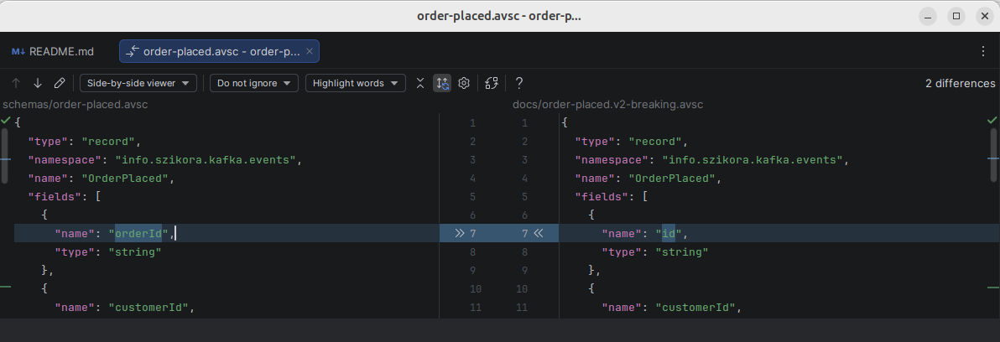

# Failure scenarios - lab notebook

## 1. Schema Registry rejects a breaking schema change

### Setup

Register schema as v1, then apply the FULL compatibility rule on it.

#### Register v1 of order-placed under the subject "orders-placed-value"

```shell
curl -s -X POST \
    -H "Content-Type: application/json; artifactType=AVRO" \
    --data @schemas/order-placed.avsc \
    http://localhost:8080/apis/registry/v2/groups/default/artifacts/orders-placed-value/versions | jq .
#Output:    
#{
#  "name": "OrderPlaced",
#  "createdBy": "",
#  "createdOn": "2026-05-19T13:44:21+0000",
#  "modifiedBy": "",
#  "modifiedOn": "2026-05-19T13:44:21+0000",
#  "id": "orders-placed-value",
#  "version": "1",
#  "type": "AVRO",
#  "globalId": 1,
#  "state": "ENABLED",
#  "contentId": 1,
#  "references": []
#}
```

#### Set FULL compatibility

```shell
# set compatibility mode
curl -s -X POST \
    -H "Content-Type: application/json" \
    --data '{"type":"COMPATIBILITY","config":"FULL"}' \
    http://localhost:8080/apis/registry/v2/groups/default/artifacts/orders-placed-value/rules
    
# verify compatibility rule is set
curl -s -X GET \
    -H "Content-Type: application/json" \
    http://localhost:8080/apis/registry/v2/groups/default/artifacts/orders-placed-value/rules/COMPATIBILITY
#Output:
#{"config":"FULL","type":"COMPATIBILITY"}%      
```

### Failure

We rename the orderId field to id and try to register the result as v2 of the same subject.



#### Try to register a breaking schema

```shell
curl -s -X POST \
    -H "Content-Type: application/json; artifactType=AVRO" \
    --data @docs/order-placed.v2-breaking.avsc \
    http://localhost:8080/apis/registry/v2/groups/default/artifacts/orders-placed-value/versions | jq .
#Output:
#{
#  "causes": [
#    {
#      "description": "id",
#      "context": "/fields/0"
#    },
#    {
#      "description": "orderId",
#      "context": "/fields/0"
#    }
#  ],
#  "message": "Incompatible artifact: orders-placed-value [AVRO], num of incompatible diffs: {2}, list of diff types: [id at /fields/0, orderId at /fields/0] Causes: id at /fields/0, orderId at /fields/0",
#  "error_code": 409,
#  "detail": "RuleViolationException: Incompatible artifact: orders-placed-value [AVRO], num of incompatible diffs: {2}, list of diff types: [id at /fields/0, orderId at /fields/0] Causes: id at /fields/0, orderId at /fields/0",
#  "name": "RuleViolationException"
#}
```

Apicurio returned **two** diffs because FULL compatibility checks both directions:

- **Backward** (new readers, old data): the new schema requires `id` with no default,
  so a new reader cannot deserialize a record that only has `orderId`. → `id at /fields/0`
- **Forward** (old readers, new data): the old schema requires `orderId` with no default,
  so an old reader cannot deserialize a record that only has `id`. → `orderId at /fields/0`

A field rename is the textbook example of a change that fails both directions, which is
why a registry with FULL compatibility refuses it.

### Production lessons from this scenario

- **`AUTO_REGISTER_ARTIFACT=true`** in the producer (which our Java producer has) would have moved
  this same 409 from CI/deploy time to message-send time in production. In a real system this rule
  should be off; schemas get registered through the CI/CD pipeline, not from running applications.
- **Per-artifact vs registry-global rules.** We set FULL on `orders-placed-value` only. The other
  subject `customer-profiles-value` has no rule, so an equally broken evolution there would be
  accepted silently. A production registry should have a default compatibility rule at the registry
  level, with per-subject overrides only where stricter or looser is justified.

<!-- TODO: ## 2. Cross-language Avro through a shared registry — embed running-java-consumer-and-python-validator-for-records.png + 2 sentences on the round-trip -->

## 3. In-memory schema registry loses state on restart

### Setup

Day 4 chose `apicurio/apicurio-registry-mem` for simplicity. That variant keeps everything — schemas, the globalId counter, compatibility rules — in JVM heap. Day 5 restarted the cluster (for an unrelated broker-volume-path fix), which restarted the Apicurio container.

### Failure

The Streams app crashed deserializing records from `customer-profiles`:

```
ArtifactNotFoundException: No artifact with ID '11' in group 'null' was found.
```

The globalId in the error didn't exist in the current Apicurio session — even though the customer-profiles topic still had records that referenced it.

### Diagnosis

Apicurio's wire format prepends each record's value with `magic_byte + 4-byte globalId`. The deserializer reads the globalId off the wire and looks up the corresponding schema. With the `-mem` backend:

- Schemas got assigned globalIds 1, 2, 3, … during the original session.
- Topic records have those globalIds baked into their wire prefix.
- On Apicurio restart, both the schemas *and the globalId counter* were wiped.
- Re-registering produced new globalIds (5, 6, …), unrelated to the IDs in the topic data.
- Those old globalIds were now dangling pointers to a registry session that no longer exists.

### Fix

Switch Apicurio to a persistence-backed variant. We chose `apicurio/apicurio-registry-kafkasql`, which uses a single-partition compacted Kafka topic (`kafkasql-journal`) on the existing cluster to persist all registry state.

Required compose changes:

```yaml
apicurio:
    image: apicurio/apicurio-registry-kafkasql:2.5.10.Final
    environment:
      KAFKA_BOOTSTRAP_SERVERS: kafka-1:19092,kafka-2:19092,kafka-3:19092
      KAFKASQL_TOPIC_REPLICATION_FACTOR: 3
```

The `KAFKASQL_TOPIC_REPLICATION_FACTOR: 3` is required because our broker-default `min.insync.replicas=2` would otherwise block Apicurio's first write to the journal (default RF=1 fails to satisfy min.isr=2).

### Production lessons

- **Never use `-mem` for anything beyond a throwaway demo.** It creates a whole class of "weird 404s on globalId N" failures that are invisible until a restart, then suddenly visible across every consumer.
- **The schema registry's persistence layer is itself critical infrastructure**, and earns the same durability contracts (RF=3, min.isr=2) as application data. `kafkasql` reuses the existing Kafka cluster's durability story; `sql` introduces a PostgreSQL dependency. Pick deliberately based on operational preferences.
- **A persistent registry doesn't retroactively rescue already-written data with dead globalIds.** After migrating to kafkasql, the topic data still references the old globalIds. Recovery requires deleting + recreating the affected topics — or pre-registering schemas with the *same* globalIds, which Apicurio doesn't let you choose.
- **kafkasql-journal is single-partition by design.** The registry needs strict total order across all instances; that requires one partition. Same reason `__cluster_metadata-0` is single-partition. Throughput doesn't matter — schema writes happen at deploy time.

## 4. Pre-registered schemas don't match runtime canonical form

### Setup

Interview narrative we wanted: *"schemas are registered via CI, never by running apps with AUTO_REGISTER."* So we wrote `scripts/register-schemas.sh` to POST each `.avsc` from `/schemas/` to Apicurio, and set `AUTO_REGISTER_ARTIFACT=false` on the Streams app's serdes.

### Failure

The Streams app failed during state-store writes with:

```
ArtifactNotFoundException: No artifact with ID 'customer-profiles-value' in group 'null' was found.
```

— even though `customer-profiles-value` clearly existed in Apicurio (we'd just registered it). The error name is misleading: it actually means "no version of this artifact has matching content for the schema you're trying to look up."

The schema content the serializer was looking for (visible in the cache-update log line):

```json
{"name":"customerId","type":{"type":"string","avro.java.string":"String"}}
```

The schema content the script *registered* (from raw `.avsc`):

```json
{"name":"customerId","type":"string"}
```

Different content → different hash → not found.

### Diagnosis

Two divergences between raw-`.avsc` form and the runtime canonical form Apicurio's Java client uses:

1. **`avro.java.string` property injection.** The avro-maven-plugin, configured with `<stringType>String</stringType>`, generates Java classes whose embedded `SCHEMA$` constant carries `"avro.java.string":"String"` on every string field. The raw `.avsc` files don't. Avro's parsing-canonical-form computation keeps this property, so the hashes differ.
2. **Named-type decomposition.** When the Apicurio Java client encounters a record schema that references a named type (e.g. `CustomerProfile` referencing the `Tier` enum), it decomposes the schema into *separate* Apicurio artifacts: one for `Tier` (artifact ID = fully-qualified `info.szikora.kafka.events.Tier`), one for `CustomerProfile` with a reference. The raw `.avsc` form inlines the enum.

### Partial fix (option C in our exploration)

For the named-type issue: split `customer-profile.avsc` into a separate `tier.avsc` + a reference-bearing `customer-profile.avsc`, register `Tier` first, then register `customer-profiles-value` using Apicurio's `application/create.extended+json` body shape with a `references` array. The avro-maven-plugin needs an `<imports>` element pointing at `tier.avsc` so it resolves the reference at compile time.

The `avro.java.string` mismatch persists even after the split, because Avro's canonical form keeps that property and our script registers raw text.

### Fix we ended up taking (pragmatic)

Set `AUTO_REGISTER_ARTIFACT=true` on the Streams app's apicurioConfig, with an inline comment documenting the lesson. The runtime serializer registers schemas in their actual canonical form on first write; subsequent writes find them.

### Production lessons

- **Pre-registration only works if the registered content matches what the runtime actually computes.** Raw `.avsc` registration doesn't satisfy this for Avro's parsing-canonical-form.
- **The proper fix is to extract schemas from compiled artifacts**, not from source `.avsc` files. A small build step that calls `SomeType.SCHEMA$.toString()` (or the equivalent canonical-form method) on every generated Avro class and writes the result to a JSON file gives you exactly-canonical schemas to register. That's what your CI pipeline should publish, not the raw .avsc.
- **AUTO_REGISTER in dev, extract-from-compiled in prod** is a clean staged approach. Document the gap explicitly so AUTO_REGISTER doesn't get flipped on in prod under deadline pressure.
- **Apicurio's named-type decomposition isn't a wart**, it's actually a useful property — it deduplicates shared types across many subjects (one `Tier` definition, referenced by N subjects). Confluent Schema Registry inlines instead, which is simpler but means N copies of the same `Tier` in the registry.

## 5. Stream-table join: stale Kafka timestamps cause stream-side head-of-line dropping

### Setup

The orders-aggregator Streams app does a `KStream<orders-placed>.leftJoin(KTable<customer-profiles>)`. On a fresh aggregator start — wiped state dir + deleted consumer group — with both topics already populated, the join was supposed to enrich each order with the customer's tier.

### Failure

Every order — all 10, all customers known and seeded — got filtered out as "no profile":

```
WARN  OrdersAggregator - dropping order ... — no profile for customerId=alice
WARN  OrdersAggregator - dropping order ... — no profile for customerId=bob
... (10 of these) ...
```

A few seconds *after* the last dropped order, the state store *did* eventually contain all 4 profiles — but by then there were no orders left to look up against.

### Diagnosis (after substantial misdirection)

What looked like the cause at various points (all wrong):

1. **State-store restoration is buggy.** The "End offset for changelog X initialized as 0" log lines while `kafka-get-offsets` showed end offsets clearly > 0 looked like a metadata staleness bug.
2. **`REUSE_KTABLE_SOURCE_TOPICS` optimization is interfering.** Flipped `topology.optimization` from `OPTIMIZE` to `NO_OPTIMIZATION`. Same behavior.
3. **`max.task.idle.ms=10000` isn't waiting.** It seemed like the stream side wasn't being held until the table side caught up.

The actual mechanism — only obvious once we looked at the *Kafka timestamps* in the dropped-order logs:

**Kafka Streams processes records across input topics in event-time order**, picking the next record by lowest Kafka timestamp (CreateTime, by default) across all input partitions of a task. The state store reflects "what Streams has processed so far," not "what the topic logically contains."

In our run:

- Orders were produced earlier in the session — Kafka CreateTime timestamps from then.
- Profiles were re-seeded later, during the debugging — Kafka timestamps from minutes ago.
- Streams processed in timestamp order → all 10 orders first (oldest timestamps), against an empty state store, all dropped → then the 4 profiles, populating the state store after the orders were gone.

`max.task.idle.ms` didn't help because it only waits when a partition buffer is *empty*. Both topics had records buffered, so no idle wait was needed — Streams just picked the next record by timestamp.

### Fix

Re-produce orders so their Kafka timestamps are *newer* than the most recent profile timestamps. This flips the processing order: profiles first (oldest), state store populates, orders second, join hits matches.

In practice: with the aggregator already running, just `./scripts/producer.sh` from another terminal. The aggregator had already processed the 4 profiles after the 10 stale orders (state store fully populated by the time we got to this point), so fresh orders arrived at a ready state store and produced 10 successful joins.

### Production lessons

- **KStream-KTable join semantics are "current state-store value at processing time."** It is *not* a historical "as-of" lookup. The compacted topic backing a KTable makes state-store rebuilding correct and bounded; it does not make the join time-traveling. The user pointed this out to me after I'd handwaved the wrong direction — important not to confuse "topic retains data" with "join sees historical state."
- **Streams processes records in event-time order across all task inputs.** Backfill scenarios (or, in our case, accumulated stale producer runs) where the stream side has older timestamps than the table side will starve the table side — by the time the table catches up, the stream has been fully drained against an empty state store.
- **Real-world mitigations**:
  - **Custom TimestampExtractor on the table source**, using wall-clock or a "max(eventTime, now())" hybrid, so the table always counts as the freshest input and is processed first.
  - **Versioned state stores** (KIP-695, Streams 3.5+) explicitly enable as-of-event-time lookups when business semantics actually require time-travel.
  - **Order the producer/seeder timing** so the table side has older timestamps than the stream side. Brittle, but adequate for demos and for batch-replay scenarios you control.
  - **`max.task.idle.ms` is necessary but not sufficient.** It handles "the table fetcher is briefly behind, give it a moment." It doesn't handle "both sides have records buffered but the stream side is older by hours."
- **Symptom-vs-cause discipline:** the "end-offset reports 0 but the topic has records" was a red herring driven by Streams' own log-output framing, not by an actual offset-query bug. The real signal was *"the orders that got dropped have stamps from 6 hours ago, while profiles have stamps from 13 minutes ago."* Always read the record timestamps in failure logs first — they tell you the processing order Streams will pick.

## 6. Apicurio globalId vs ccompat contentId: cross-language reads break after schema churn

### Setup

The pipeline writes Avro via Apicurio's Java serdes (`ENABLE_HEADERS=false` + `Legacy4ByteIdHandler`, i.e. the Confluent-style 4-byte-ID wire format). The Python validator reads via confluent-kafka-python against Apicurio's Confluent-compat endpoint (`/apis/ccompat/v7`). On Day 4 this round-trip worked. On Day 5, reading the new `orders-per-window` topic, the Python validator crashed:

```
EOFError   (fastavro _read.read_long, inside read_record)
```

### Diagnosis

The key bytes on `orders-per-window` decoded *by hand* to a perfectly valid 3-field `OrdersPerWindowKey` (`00 | 00 00 00 12 | 06 "bob" 06 "PRO" 06 "..."`). So the payload was fine. The problem was the **embedded schema ID = 18**:

- `curl .../apis/registry/v2/ids/globalIds/18` → `OrdersPerWindowKey` (3 fields) ✓ — the key is stamped with its correct **globalId**.
- `curl .../apis/ccompat/v7/schemas/ids/18` → `OrdersPerWindow` (7 fields) ✗ — ccompat resolves `18` as a **contentId**, landing on a different schema.

Decoding 3-field key bytes with the 7-field schema reads customerId/tier/currency, then EOFs reaching for `windowStartMs`.

Root cause: **Apicurio maintains two independent ID sequences.** `globalId` is a monotonic counter bumped by every registration (including of since-deleted artifacts); `contentId` is assigned per unique schema content. The `Legacy4ByteIdHandler` embeds the **globalId** in the wire prefix by default, but the ccompat endpoint — which every Confluent client speaks — resolves its `id` as the **contentId**. Early in the project (few schemas, no deletions) `globalId N == contentId N`, so the mismatch was invisible and Day 4 worked *by coincidence*. After a day of register/delete/re-register churn (kafkasql migration, the reference split, AUTO_REGISTER creating canonical-form duplicates), the two sequences drifted apart and the coincidence broke.

### Fix

Configure every Apicurio serde to embed the **contentId** instead of the globalId, so the wire ID matches what ccompat resolves:

```java
props.put(io.apicurio.registry.serde.SerdeConfig.USE_ID, "contentId");
```

Applied to all three serde configs (producer, seeder, Streams app) so the whole pipeline is consistent. Because this changes the wire format, all existing topic data (stamped with globalId) had to be wiped and repopulated, including the Streams internal repartition/changelog topics. After the reset, keys carried `contentId` and the Python validator decoded both key and value cleanly.

### Production lessons

- **`Legacy4ByteIdHandler` (globalId) + a Confluent client (contentId) is a latent landmine.** It works until the first artifact delete causes the two ID sequences to diverge, then every cross-language read fails. If you write with Apicurio serdes and read with Confluent clients, set `USE_ID=contentId` from day one.
- **"Works in the demo" is not "works."** The Day 4 success was correct-by-coincidence — aligned IDs masked a real config gap. Worth distrusting any integration that only ever ran against a freshly-seeded registry.
- **Two debugging tools made this tractable:** (1) hand-decoding the Avro wire prefix (`magic | 4-byte id | zigzag-length-prefixed fields`) proved the *payload* was correct and isolated the fault to the ID; (2) querying the same numeric ID through *both* the native (`/ids/globalIds/N`) and ccompat (`/schemas/ids/N`) endpoints and getting *different schemas back* was the smoking gun.
- **Confluent Schema Registry doesn't have this split** — it has a single schema-ID space — which is one concrete reason a team standardizing on Confluent clients might prefer CSR over Apicurio, or at least standardize the `USE_ID` setting cluster-wide.

## 7. EOS v2: internal-topic replication factor vs min.insync.replicas, and benign cold-start changelog noise

### Setup

Day 5's last task: flip the orders-aggregator to exactly-once.

```java
props.put(StreamsConfig.PROCESSING_GUARANTEE_CONFIG, StreamsConfig.EXACTLY_ONCE_V2);
props.put(StreamsConfig.REPLICATION_FACTOR_CONFIG, 3);
```

The topology didn't change at all — EOS is purely a runtime concern. The second line is the one that matters here. We did a full reset first (wiped data topics + all `orders-aggregator-v1-*` internal topics + state dir + consumer group), so the very first run had to *create* the internal changelog/repartition topics from scratch.

### The latent failure we avoided (why `REPLICATION_FACTOR_CONFIG=3` is load-bearing)

Enabling EOS forces the internal producer to `acks=all` (`acks = -1` in the producer config dump) — non-negotiable, because a transaction can't be durable otherwise. Our brokers run `min.insync.replicas=2`. But Streams' internal topics — the `aggregate` changelog, the `selectKey`/`groupByKey` repartition topic — default to **`replication.factor=1`** unless overridden.

Chain that produces the failure:

```
RF=1  +  acks=all  +  min.insync.replicas=2
  → the partition can never reach 2 in-sync replicas
  → every produce to that changelog fails: NOT_ENOUGH_REPLICAS
  → the app dies on startup (or first commit)
```

Setting `REPLICATION_FACTOR_CONFIG=3` makes the internal topics match the data topics' durability and clears the ISR floor. Verified after startup:

```shell
kafka-topics.sh --bootstrap-server localhost:9092 --describe \
  --topic orders-aggregator-v1-KSTREAM-AGGREGATE-STATE-STORE-0000000007-changelog
# ReplicationFactor: 3   Configs: min.insync.replicas=2,cleanup.policy=compact,delete,retention.ms=86700000
#   Partition: 0  Leader: 2  Replicas: 2,3,1  Isr: 2,3,1
#   ... (all 6 partitions: full ISR 1,2,3) ...
```

Aside worth noting: the changelog's `cleanup.policy=compact,delete` (not plain `compact`) and `retention.ms=86700000`. A **windowed** store's changelog ages out dead windows — `300000` (the 5-min window) + `86400000` (the default `windowstore.changelog.additional.retention.ms`, 1 day) = `86700000`. Streams sized that retention from the window definition. A non-windowed KTable changelog would be `compact` only, retained forever.

### What *looked* like a failure but wasn't (cold-start noise)

On the fresh-reset first run, before the internal topics existed, the log threw a wall of alarming-looking errors:

```
ERROR PartitionLeaderStrategy - Received unknown topic error for topic
  orders-aggregator-v1-...-STATE-STORE-0000000001-changelog
  org.apache.kafka.common.errors.UnknownTopicOrPartitionException

INFO  StreamsPartitionAssignor - Failed to retrieve all end offsets for changelogs,
  and hence could not calculate the per-task lag; this is not a fatal error but would
  cause the assignor to fallback to a naive algorithm

WARN  ClientState - Task 1_0 had endOffsetSum=-3 smaller than offsetSum=0 ...
  This probably means the task is corrupted, which in turn indicates that it will
  need to restore from scratch if it gets assigned.
```

None of these are problems:

- The assignor queries each changelog's **end offset** to compute per-task lag (input to the sticky, stateful task-assignment algorithm). On a fresh reset the changelog topics don't exist yet → the query throws `UnknownTopicOrPartitionException` → the assignor explicitly logs *"not a fatal error"* and falls back to a lag-unaware assignment.
- `endOffsetSum=-3` — the `-3` is the **sentinel for "topic doesn't exist"** (three changelog partitions × the unknown marker). Streams reads "can't determine state" as "treat as corrupt → restore from scratch," which on a nonexistent topic means restore **0 records**.
- A followup rebalance fires, the internal topics get auto-created (at RF=3), and every task logs `Finished restoring ... with a total number of 0 records` → `State transition from PARTITIONS_ASSIGNED to RUNNING`.

The tell that it's all benign: **every task ends `Restored and ready to run`**, and the app reaches `RUNNING`. The same warnings on a *warm* restart (topics exist, state present) would mean genuine corruption.

### Fix

- The latent failure: `REPLICATION_FACTOR_CONFIG=3` (above). The real fix.
- The cold-start noise: no fix needed — recognize it. Confirm `RUNNING` + every task `Restored and ready to run` + `Finished restoring ... 0 records`.

### Production lessons

- **EOS forces `acks=all` on internal producers, so internal-topic RF must satisfy `min.insync.replicas` or transactions can't commit.** `replication.factor` defaults to 1; either set `StreamsConfig.REPLICATION_FACTOR_CONFIG` explicitly (we did) or raise the broker's `default.replication.factor`. This is *the* classic EOS-enablement gotcha — the topology compiles, the demo "starts," and then the first commit storms `NOT_ENOUGH_REPLICAS`.
- **`endOffsetSum=-3` + "task corrupted" on a first run after a reset is expected, not alarming.** The signal that distinguishes real corruption from cold-start noise is whether tasks reach `Restored and ready to run` and the client transitions to `RUNNING`. Real corruption recurs on a warm restart; cold-start noise happens once, on the run that creates the topics.
- **EOS auto-sets `isolation.level=read_committed` on the consumers** (visible in both consumer config dumps). That's *why* exactly-once composes across a multi-stage topology: each stage refuses to read another stage's uncommitted/aborted output. You don't set it; Streams does.
- **`commit.interval.ms` drops from 30 000 to 100 ms under EOS.** Transactional commits are more expensive, so Streams trades throughput for latency to keep the transaction window small. Tunable if you'd rather amortize commit cost over larger batches at the price of end-to-end latency.
- **`transactional.id` is derived deterministically** (`<application.id>-<...>-<n>`), which is what lets the broker **fence a zombie instance**: a restarted/duplicated StreamThread claiming the same transactional.id bumps the producer epoch and locks out the stale one. Deterministic IDs are the mechanism behind EOS surviving rebalances and crashes.
